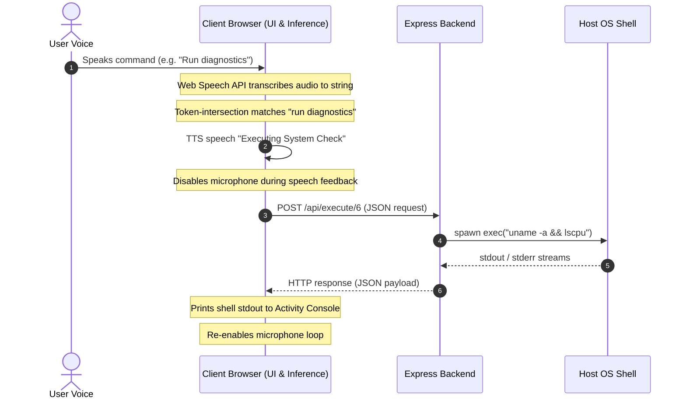

# VoxCommand 🎙️

A lightweight, high-performance voice control service featuring client-side Web Speech recognition (inference) and local shell command automation.

VoxCommand allows you to control your web browser and execute local applications/diagnostics on your host machine simply by speaking trigger phrases. It runs across your Local Area Network (LAN) via a simple HTTP server.

---

## ⚠️ Safety Disclaimer
> [!WARNING]
> **VoxCommand has host-level shell access.**
> Because the service executes arbitrary shell scripts specified in the command dashboard (using Node.js `child_process.exec`), running it on an unprotected port exposed to the public internet presents a severe security risk. 
> 
> Only run VoxCommand within **trusted Local Area Networks (LAN)** or local host loops. By default, it binds to all interfaces (`0.0.0.0`) to facilitate LAN device access. Keep your ruleset inside `commands.json` restricted to safe utility commands.

---

## 🏗️ System Architecture

VoxCommand utilizes a client-heavy model where raw processing is handled by the client browser to maximize host scalability.



### Key Behaviors:
- **Speech Synthesis Loop Prevention**: When VoxCommand speaks back to the user via the `SpeechSynthesis` API, it temporarily halts the `SpeechRecognition` listener. This prevents a feedback loop where the assistant hears and re-transcribes its own voice confirmations.
- **Fuzzy Token Matching**: Rather than rigid string comparison, VoxCommand splits triggers and vocal input into token sets. If all words of a trigger phrase are present in the vocal input (e.g., trigger: `"open terminal"`, vocal input: *"hey computer open my terminal please"*), the match succeeds.

---

## 🔌 API Specification

All data operations are conducted via a lightweight JSON API served by the Express backend:

### 1. Retrieve Configured Commands
* **Endpoint**: `GET /api/commands`
* **Response**: `200 OK`
  ```json
  [
    {
      "id": "1",
      "name": "Google",
      "phrase": "open google",
      "type": "web",
      "action": "https://www.google.com"
    }
  ]
  ```

### 2. Add or Update a Command
* **Endpoint**: `POST /api/commands`
* **Request Body**:
  ```json
  {
    "id": "1", // Optional. If omitted, a timestamp ID is generated.
    "name": "Google Search",
    "phrase": "open google",
    "type": "web",
    "action": "https://www.google.com"
  }
  ```
* **Response**: `200 OK` on success, `400 Bad Request` if mandatory fields are missing.

### 3. Delete a Command
* **Endpoint**: `DELETE /api/commands/:id`
* **Response**: `200 OK` on success, `404 Not Found` if the command ID does not exist.

### 4. Execute a Local Shell Command
* **Endpoint**: `POST /api/execute/:id`
* **Response**: `200 OK`
  ```json
  {
    "success": true,
    "stdout": "Linux workstation 6.8.0-generic...",
    "stderr": ""
  }
  ```
  Returns `400 Bad Request` if the command is of type `web`, and `404 Not Found` if the ID is missing.

---

## 🛠️ Detailed Dependencies

- **Node.js**: Version `v22.x` or higher recommended.
- **Express.js (`^4.19.2`)**: Handles static page serving and API requests.
- **Client Web Browser**: A browser supporting the `Web Speech API` (Google Chrome, Microsoft Edge, and Chromium-based browsers are strongly recommended).
  > [!NOTE]
  > Firefox and Safari have limited support for the continuous speech recognition attributes used by this application.

---

## 💡 Use Case Applications

VoxCommand is useful for several dev-environment scenarios:
1. **Developer Workspaces**: Open coding platforms, project repositories, or communication tools hands-free (e.g. *"open github"* or *"open slack"*).
2. **System Utilities**: Launch utilities locally while coding (e.g. *"open terminal"*, *"open calculator"*).
3. **Hardware Integration / Diagnostics**: Check CPU usage, disk space, or system logs via custom shell rules (e.g. trigger: *"run diagnostics"* -> script: `uname -a && free -h`).
4. **Smart Home/Workstation Automation**: Expand local commands to trigger smart switches or smart plugs using local curl commands.

---

## 🏃 Operation Instructions

### 1. Installation
Install project dependencies:
```bash
npm install
```

### 2. Background Startup
Start the service in the background. This will write the process PID to `server.pid` and direct output streams to `server.log`:
```bash
./start.sh
```
Upon startup, the script will echo the status log to display available access addresses, looking similar to:
```
=============================================================
VoxCommand Server is listening:
  - Local:   http://localhost:3300
  - LAN:     http://10.0.0.200:3300
=============================================================
```

### 3. Accessing the Dashboard & Enabling Mic
1. Open Chrome, Edge, or any Chromium-based browser and visit the server address.
   * **Local Loopback:** Visit `http://localhost:3300`. Since `localhost` is natively treated as a **Secure Context** by browsers, microphone permissions will work immediately out of the box with no extra configuration.
   * **LAN access (Remote Devices):** Visit the LAN URL (e.g., `http://10.0.0.200:3300`). Because non-localhost HTTP is considered insecure, modern browsers will block microphone access. To bypass this security restriction and allow microphone input over local HTTP:
     1. Open Chrome/Edge and go to `chrome://flags/#unsafely-treat-insecure-origin-as-secure`.
     2. Enable the flag.
     3. Add your server's LAN address (e.g., `http://10.0.0.200:3300`) to the input text box.
     4. Relaunch the browser.
2. Once loaded, click the glowing **Microphone Orb** in the center of the page to start listening and approve the microphone permission prompt.

### 4. Stopping the Service
Stop the background execution cleanly, terminate subprocesses, and remove PID references:
```bash
./stop.sh
```

### 5. Reviewing System Logs
You can inspect server output streams at any time:
```bash
cat server.log
```
